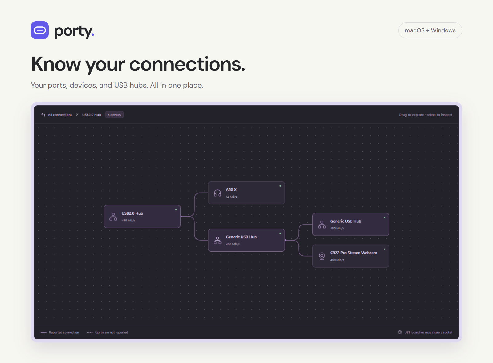

# Porty

### Know your connections.

Ever wondered what's plugged into which hub, how fast a USB connection is running, or what your computer's ports can actually do? Porty brings it all into one friendly desktop app for **macOS and Windows**.



**[Visit the website](https://porty.walt.online)** · **[Releases](https://github.com/waltzaround/porty/releases)** · **[Technical docs](docs/TECHNICAL.md)**

## A clearer picture of your desk

- **Follow your connections.** Explore devices and USB hubs in a visual connection map.
- **Find the right port.** Browse by connector type and see what's connected.
- **See what's happening now.** Check reported USB link speeds, display resolutions, refresh rates, and charging information.
- **Catch intermittent connections.** The event log records USB/display notifications on Mac and compares scans for other reported changes. Save the session history when investigating a dock that reconnects unexpectedly.
- **Look a little closer.** Open a device or port for its capabilities and the information behind them.
- **Keep it local.** Hardware scans run on your computer. No account, telemetry, or cloud service required.

Porty shows what your operating system reports and clearly labels information from manufacturer specifications. If something can't be determined, it stays **unreported**. Available details vary by computer, operating system, cable, and device.

## Troubleshooting

If Porty runs with a blank window, use **View → Reload Porty** or **Help → Troubleshooting**. Startup recovery and local diagnostics work independently of the hardware scan. Unavailable readings are not proof that a permission was denied; see [startup and accessory help](docs/TROUBLESHOOTING.md).

## Try Porty

Head to **[porty.walt.online](https://porty.walt.online)** for available downloads and screenshots. Porty is in preview, and hardware coverage is still growing.

Using a setup that Porty doesn't recognise? [Open an issue](https://github.com/waltzaround/porty/issues) with your computer model, operating system, and what you expected to see. Please remove serial numbers and other personal details from anything you share.

## Hardware guides

- [How to check USB connection speed on Mac](https://porty.walt.online/guides/check-usb-speed-mac/)
- [How to view a USB device tree on Windows](https://porty.walt.online/guides/usb-device-tree-windows/)
- [Why a USB 3 hub can show 480 Mb/s](https://porty.walt.online/guides/usb-3-hub-480-mbps/)

Each guide includes practical checks, reported hardware examples, and links to Apple, Microsoft, or USB-IF documentation.

## Thank you, WhatCable

Porty was inspired in part by **[WhatCable](https://github.com/darrylmorley/whatcable)** by **Darryl Morley**, and adapts some of its MIT-licensed code for macOS USB-C cable identification and power decoding. Thank you for making that work available and helping make confusing connections easier to understand.

See the [WhatCable website](https://whatcable.uk), our [detailed attribution](THIRD_PARTY_NOTICES.md), and the [included WhatCable licence](licenses/WhatCable.txt) for the original project, adapted modules, and licence terms.

## Build it yourself

With **Node.js 22.12+** and npm installed:

```sh
git clone https://github.com/waltzaround/porty.git
cd porty
npm ci
npm run dev
```

For detection details, supported hardware, testing, and packaging, see the **[technical documentation](docs/TECHNICAL.md)**. Signing and distribution are covered in **[release preparation](RELEASING.md)**.

---

Made by [Walt](https://walt.online).
